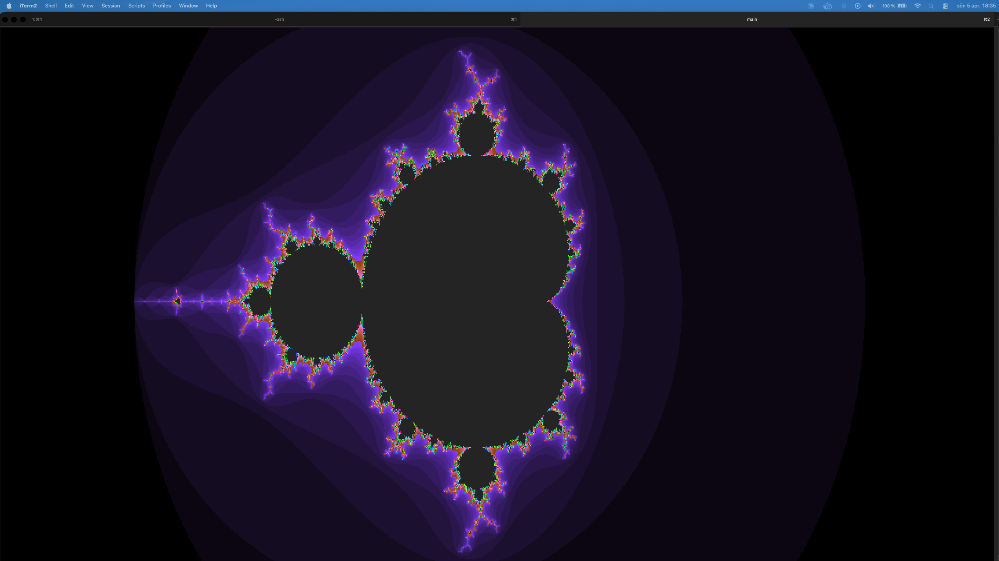

# mandelbrot

A Mandelbrot set renderer in the terminal using ANSI escape codes and Unicode block characters. Adapts to your terminal size and supports real-time pan and zoom.

## Build

```sh
gcc main.c -o main
```

## Run

```sh
./main
```

Zoom in before panning for best results — the default view shows the full set.

## Controls

| Key | Action |
|-----|--------|
| `w a s d` | Pan up / left / down / right |
| `z` | Zoom in |
| `x` | Zoom out |
| `q` | Quit |

## Notes

- Resolution is limited by terminal character size — a larger terminal window gives more detail
- Colors are based on escape time: how many iterations before a point diverges
- The terminal is restored to its original state on quit (`q` or `Ctrl+C`)


## Example output
This is an example of the output for a teminal of size: 456 x 2533

